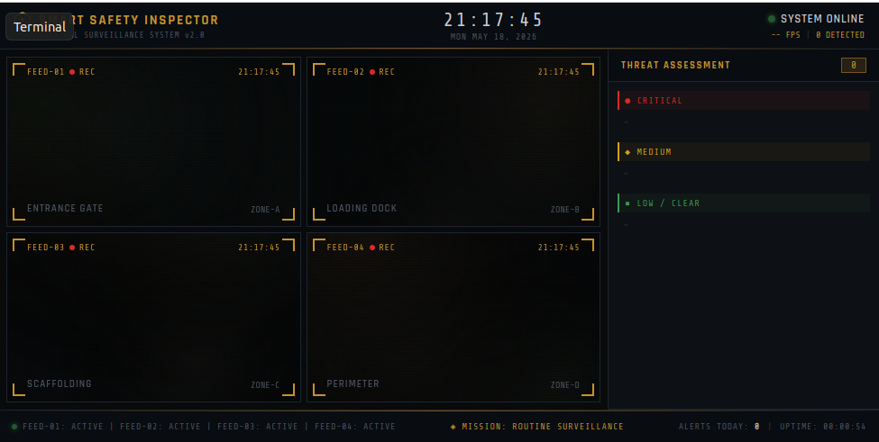
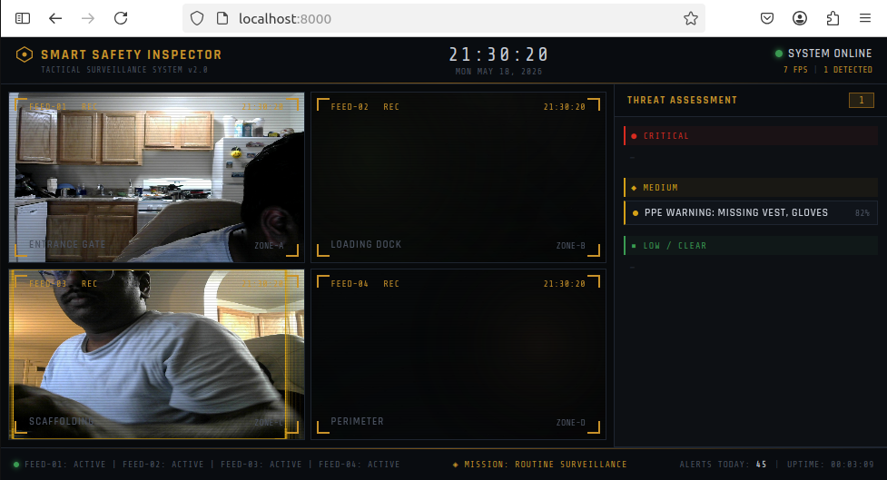
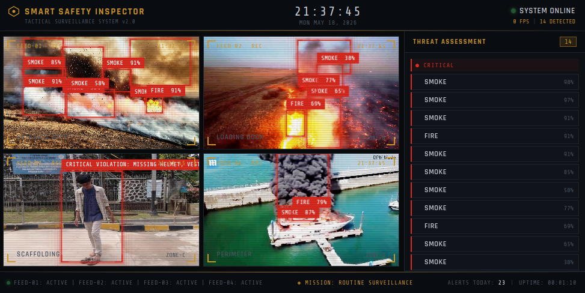

# 🛡️ Smart Safety Inspector: Tactical Edge HUD
**Industrial-Grade Workplace Safety & Hazard Monitoring System**


The **Smart Safety Inspector** is a high-performance computer vision solution designed for real-time safety compliance monitoring. Featuring a state-of-the-art "Tactical HUD" interface, the system processes multiple hardware camera streams concurrently to detect PPE violations, fire hazards, and unauthorized personnel in industrial environments.

---

## 🚀 Core Features
*   **Tactical Surveillance HUD**: A high-engagement, dark-mode dashboard providing real-time visual overlays, interactive camera zooming, and threat assessments.
*   **True Multi-Camera Processing**: Dynamically bounds and multiplexes multiple hardware video devices (`/dev/video*`) into unified WebSocket payloads.
*   **3-Tier Safety Logic**:
    *   🟢 **SAFE**: Full PPE compliance.
    *   🟡 **WARNING**: Minor violations (e.g., missing gloves).
    *   🔴 **CRITICAL**: Major hazards (Fire, Smoke, or Multiple PPE failures).
*   **Boundary-Aware Intelligence**: Smart detection logic that ignores "missing boots" if a worker's feet are off-camera.
*   **Platform Agnostic**: Optimized for both **Windows Development** and **NVIDIA Jetson Orin Nano** (Live Production via Docker).

---

## 📷 Interface & System Demos

### 🖥️ Tactical HUD Dashboard
A premium dark-mode dashboard showcasing live feeds, active safety violations, and real-time threat metrics:


### 🔍 Real-Time PPE & Hazard Detections
Unified multi-stream processing with overlay bounding boxes and confidence metrics for helmets, vests, gloves, and other safety items:


### 📈 Model Evaluation & Inference Test
Predictive tests showing accurate safety status classifications under different environmental and PPE configurations:


### 🎥 Live Demonstrations
Watch the **Smart Safety Inspector** running live at the edge, demonstrating dynamic safety transitions, alerts, and controls:

#### PPE Tracking & Alerting Demo
<video src="screenshots/Screencast%20from%2005-18-2026%20093350%20PM.mp4" width="100%" controls></video>

#### HUD Safety Status Transitions & Stream Control Demo
<video src="screenshots/Screencast%20from%2005-18-2026%20093643%20PM.mp4" width="100%" controls></video>

---

## 📦 Deployment Guide: Windows (Development)

Follow these steps to deploy and test the application on a standard Windows machine.

### 1. Clone & Setup Environment
```powershell
# Clone the repository
git clone https://github.com/tharunkm78/Smart-Safety-Inspector-Edge.git
cd Smart-Safety-Inspector-Edge

# Create and activate virtual environment
python -m venv venv
.\venv\Scripts\Activate

# Install dependencies
pip install -r requirements.txt
```

### 2. Run the Application
The application supports two modes on Windows:

**Simulation Mode:** (Runs using the internal test dataset)
```powershell
python src/api/main.py --mode test
```

**Live Camera Mode:** (Runs using your primary webcam)
```powershell
python src/api/main.py --mode camera --sources 0
```
> **Note on Multi-Camera:** To run multiple physical webcams on Windows, pass their indices sequentially: `--sources 0,1`.

**Access the Dashboard:** Open your browser and navigate to `http://localhost:8000`.

---

## 🐳 Deployment Guide: NVIDIA Jetson Orin Nano (Production)

The Jetson deployment utilizes an L4T-optimized Docker container to grant the YOLO inference engine raw access to the NVIDIA GPU via the `nvidia` runtime, while sidestepping complex host dependency issues.

### 1. Clone the Repository
```bash
git clone https://github.com/tharunkm78/Smart-Safety-Inspector-Edge.git
cd Smart-Safety-Inspector-Edge
```

### 2. Build the Docker Container
You only need to run this command once, or whenever the underlying Python source code is modified.
```bash
# Make the scripts executable
chmod +x build_jetson.sh run_jetson.sh

# Build the optimized production image
sudo ./build_jetson.sh
```

### 3. Launch the Tactical HUD
The launch script automatically detects connected hardware cameras (`/dev/video0`, `/dev/video1`) and mounts them into the Docker container.
```bash
sudo ./run_jetson.sh camera
```
**Access the Dashboard:** Open your browser and navigate to `http://<JETSON_IP>:8000`.

---

## 📁 Repository Structure
*   `src/api/`: FastAPI server, Multi-thread orchestrator, and WebSocket logic.
*   `src/inference/`: YOLO detection and 3-Tier Safety Logic Engine.
*   `ui/`: Dashboard assets (HTML/CSS/JS).
*   `build_jetson.sh`: Docker image compilation script.
*   `run_jetson.sh`: Dynamic hardware bounding and container execution script.
*   `Dockerfile`: Jetson-optimized production container definitions.

---
**Developed by tharunkm78**  
*Hardening Workplace Safety at the Edge.*
